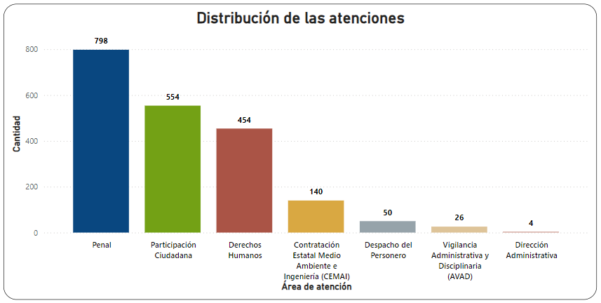
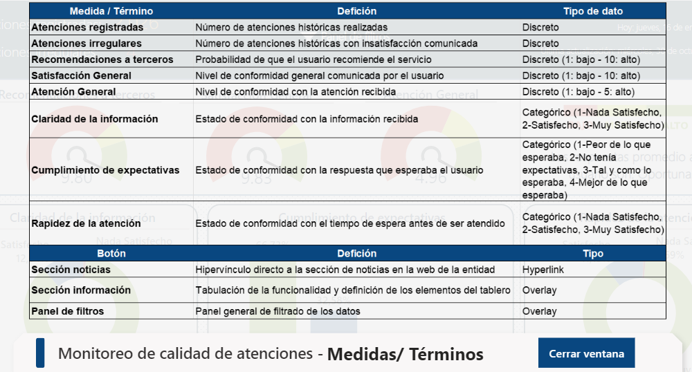

# Diseño de un tablero interáctivo para el monitoreo de la calidad del proceso de atención en la Personería de Manizales

## Resumen

El objetivo de este proyecto fue diseñar e implementar un tablero de control interactivo para el seguimiento de mediciones del proceso de atención al usuario en la Personería de Manizales, dentro de una arquitectura dirigida al uso de Power BI Service para el análisis de datos visuales. Este proyecto utilizó un conjunto de datos recolectados por el área de Calidad de la entidad, durante los últimos 2 años a través de encuestas de satisfacción electrónicas. El tablero de control implementado en el escenario organizacional difiere del presentado en este proyecto en cuanto a las limitaciones del conjunto de datos y la manera en que se conecta al producto visual, es decir, que el conjunto de datos mostrado es menor al manejado actualmente por la entidad ya que se obtienen de la web de datos abiertos nacionales cuya actualización de base datos públicas es realizada de manera anual, cada mes de octubre. Dentro de las extracciones de Insights más relevantes se encontró que el proceso de atención ejecutado por la entidad es en general excelente según la opinión de los usuarios. Sin embargo, el área de atención a requerimientos de Participación Ciudadana y Derechos Humanos han presentado no inconformidades, aunque no son representativas. ""

## Entendimiento de la problemática del negocio

El jefe de calidad de la Personería Municipal de Manizales está interesado en implementar una herramienta visual para el monitoreo de la calidad de las atenciones del departamento de Atención al usuario. Teniendo identificado este propósito, la entidad cuenta con un conjunto de mediciones relacionadas con la satisfacción y la percepción de funcionamiento que han experimentado más de 2.000 usuarios durante los últimos dos años de aplicación de encuestas electrónicas. El objetivo final de la entidad es extraer informasión valiosa periódicamente para ejecutar acciones preventivas, conociendo de antemano que, en general, la calidad de las atenciones siempre ha sido alta. Este proyecto surge entonces como respuesta a la necesidad de establecer procedimientos de monitoreo en el marco de implementación de un Sistema de Gestión de la Calidad bajo el estándar ISO 9001.

## Entendimiento de los datos

El conjunto de datos aportados por la entidad para accesibilidad pública, comprende un total de 2.028 registros de atención y 9 características asociadas a cada registro. Estas características incluyen información como el subárea de prestación del servicio, el nivel de satisfacción reportado por el usuario, la probabilidad de recomendación del servicio a terceros, la calificación asignada a la atención según la perspectiva del usuario, la postura del usuario frente a la información recibida, la percepción de rapidez de la atención, la postura frente al cumplimiento de expectativas y oportunidad de atención.
El gráfico a continuación muestra la distribución de las atenciones según las subáreas de atención.

    

## Resultados del producto visual

El producto visual resultante es un tablero de una única página, diseñado e implementado bajo Power BI services. A continuación se muestra en las ilustraciones una captura estática del tablero y la tabla de elementos y definiciones del producto.

#### **Captura estática del producto visual**

    

#### **Tabla de elementos y definiciones**

    

## Conclusión y recomendaciones

El tablero de control se consolidará como base para el seguimiento de las métricas relacionadas con la calidad del proceso de atención de la Personsería municipal de Manizales, permitiendo la extracción visual y fluida de insights para la toma de decisiones. En escenario fúturos de mejora para el tablero de control se recomienda incluir datos de la dimensión tiempo (fechas de los registros de atención) y generar KPIs con las métricas ya implementadas, con miras a establecer un seguimiento más claro de los objetivos organizacionales.
